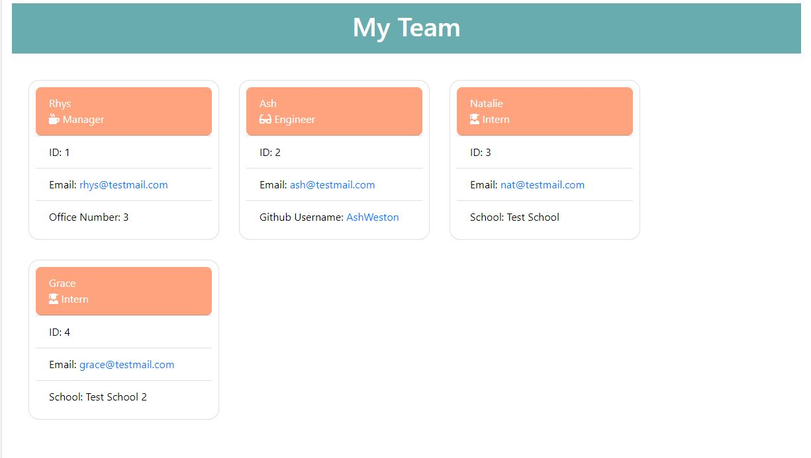
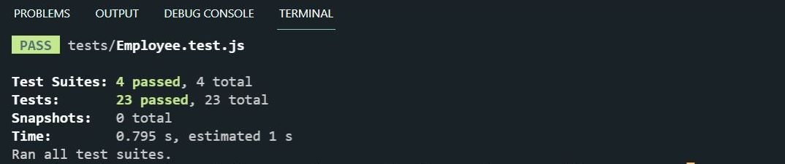

# TEAM PROFILE GENERATOR

## Description

This project was to build a Node.js command-line application that takes in information about employees on a software engineering team, then generates an HTML webpage that displays summaries for each person. Testing for each part of the code was completed using Jest to ensure each test passed.

This application uses Jest for running the unit tests and Inquirer for collecting input from the user. When prompted for information, an HTML is generated based on the user input that displays a nicely formatted team roster. The application will be invoked by using the following command: `node index.js`

## Table of Contents

- [Installation](#installation)
- [Usage](#usage)
- [Video-Walkthrough](#Video-Walkthrough)
- [Contributing](#contributing)
- [Tests](#tests)
- [Technologies](#technologies)
- [Questions](#questions)

## Installation

- Clone this repository
- Install npm by using the following command in the terminal: `npm init`
- Install inquirer by using the following command in the terminal: `npm install inquirer`

## Usage

- Invoke the application by using the following command in the terminal: `node index.js`
- Follow the prompts to enter your Manager's information
- Once completed, you can decide to add other team members using the arrow keys. You can choose to add either an engineer, an intern, or to finalise your team.
- Once you have added your team members, and finalised your team, your team will be generated in an HTML file

## Video-Walkthrough

## Contributing

You can contribute to this project by cloning this repository and commiting your code on a new branch.

## Tests

Tested using Jest - https://www.npmjs.com/package/jest

## Technologies

- HTML
- CSS
- JavaScript
- Node.js
- Inquirer
- Jest

## Questions

If you have any questions, or additional feedback, please feel free to reach out on my
GitHub Account: (https://github.com/AshWeston) or send me an email at ash-w@live.com.au.
